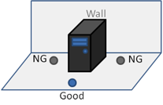
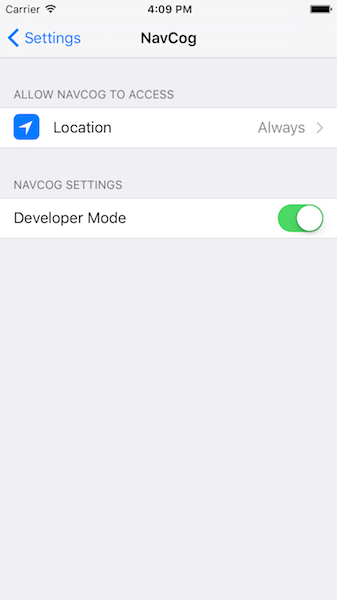
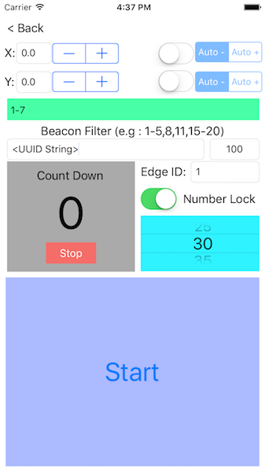

<!--
The MIT License (MIT)

Copyright (c) 2014, 2015 IBM Corporation
Permission is hereby granted, free of charge, to any person obtaining a copy
of this software and associated documentation files (the "Software"), to deal
in the Software without restriction, including without limitation the rights
to use, copy, modify, merge, publish, distribute, sublicense, and/or sell
copies of the Software, and to permit persons to whom the Software is
furnished to do so, subject to the following conditions:

The above copyright notice and this permission notice shall be included in all
copies or substantial portions of the Software.

THE SOFTWARE IS PROVIDED "AS IS", WITHOUT WARRANTY OF ANY KIND, EXPRESS OR
IMPLIED, INCLUDING BUT NOT LIMITED TO THE WARRANTIES OF MERCHANTABILITY,
FITNESS FOR A PARTICULAR PURPOSE AND NONINFRINGEMENT. IN NO EVENT SHALL THE
AUTHORS OR COPYRIGHT HOLDERS BE LIABLE FOR ANY CLAIM, DAMAGES OR OTHER
LIABILITY, WHETHER IN AN ACTION OF CONTRACT, TORT OR OTHERWISE, ARISING FROM,
OUT OF OR IN CONNECTION WITH THE SOFTWARE OR THE USE OR OTHER DEALINGS IN THE
SOFTWARE.
-->

# BLE Beacon Placement & Fingerprinting

This section describes how to set up beacons on your site and collect data for localization.

## <a name="beacon_placement"></a>BLE Beacon Placement

Beacon placement is very important since you never obtain good localization from poor beacon placement.

### Beacon Settings
item|setting
---|---
UUID|Use save UUID for your site
Major|Major should be identical for all beacons on one floor (at least nearby beacons for each edge in a route).
Minor|Use unique id in Major group
Power|-8db or -12db is recommended

### Planning Placement
Beacons should be placed keeping a moderate distance (about 8m—12m, depending on your beacons) with each other (Fig. 1). Especially in corridors, placing beacons alternately on the route


### Actual Placement
Making a “Beacon placement map” with placing beacons one by one is recommended. It’s necessary in the next fingerprinting step. Every time you place a beacon, you mark the position and memorize the Beacon ID (Major/Minor) on the map. Each beacon should be placed around nearby obstacles.


## Fingerprinting BLE Beacon Signals
Fingerprinting i.e. collecting BLE beacon signals data in the known positions on your route is necessary. A collected data set (“training data”) is used for generating the route model of localization algorithm.

Another data set collected in the same way (“test data”) is needed for [Accuracy Evaluation](#acc_eval) i.e. evaluating the accuracy of localization based on the model. This subsection describes the procedures for fingerprinting, accuracy evaluation and how to make an input file importable to your navigation application.
Preparation for Fingerprinting

A tool for fingerprinting is provided as an iOS app – NavCog. Please install it to the iOS device from AppStore.

## Configure NavCog app for development

1. open "Settings" app

    

2. You can find "NavCog"
3. Set "Developer Mode" on

    

Now you can see "**Get Data**" button in the bottom of the NavCog main view.

## <a name="fingerprinting"></a>Procedures of Fingerprinting
Please set your Beacon UUID in NavCog at first (see Fig. 3). It is assumed to be identical in your environment. Briefly speaking, the fingerprinting are two steps:

1.	For each edge in your route, measure Beacon signals at regular intervals
2.	Export fingerprinting data from the iOS device to the PC with iTunes

If you’d like to evaluate the accuracy of the generated route model, you need to go through the above Step 1-2 twice for collecting training data and test data respectively.




In the Step 1, there are several things to do for each edge in your route:

### [Preparation] Before fingerprinting,  
* Embed measure along the edge (with extra 9 feet in the both ends if there’s no wall)
  * If the edge is **3\*N** feet long, you will walk **9+3\*N+9=3\*(N+6)** feet and measure at **N+7** points.
  * Record edge length (that is requried in [editing map](map.md))
* Change Edge ID to the interest
* Set Beacon Major code
* Set Minor codes of beacons near the edge into Beacon Minor Filter box
  * For example in Fig. 4, Beacon Minor 1-7 are set for the edge from Node#1 to Node#2
* Set Number of samples to 30 for training data

###[Fingerprinting] For each points to be fingerprinted,
* Move to the point (along with the embedded measure)
* Set Y to the **feet / 3** (1.0=3ft, 2.0=6ft, 3.0=9ft, ..) from the edge start point, while fixing X to 0
  * Set y=-3.0 at the start point of fingerprinting (-9 feet from the edge start point) if there’s no wall
* Push “Start” button
  * Sampling RSSI from the beacons filtered by Minor codes every one second (RSSI: Received Signal Strength Indicator)
  * In training data sampling, you should walk around the point to simulate the variation of direction and position (vertical to the route) that people who are navigated could take (see Fig. 4).


## Preprocess Data

### Extract data from iPhone
1. connect iPhone to your Mac (USB)
2. open iTunes and select your device listed in iTunes
3. select apps view

    
4. Find "NavCog" app in the Apps list of File Shareing section
5. Create a folder (i.e. "**train**") at your Desktop
5. 	Select all files with name "**edge-xxx.txt**" and click "**Save**" button to save files in to the folder

### Concatinate individual files

1. Open **Terminal** app
2. Type the following command

   ```
   cd Desktop
   curl -O https://navcog.mybluemix.net/tools/data-merge.sh
   sh data-merge.sh train
   ```

3. You can find concatinated data files in **train-data** folder on your desktop

## <a name="acc_eval"></a>Accuracy Evaluation

1. Prepare **train-data** and **test-data** on your desktop (both folder has concatinated data files)

  You can take test data by the same procedure for training data. (**Note**: App always save fingerprinting data in edge-\<edge id\>-\<x\>-\<y\>.txt. You should extract all training data before start taking test data. It is easy if you have two iPhones for development)

2. Open **Terminal** app
3. Type the following command

   ```
   cd Desktop
   curl -O https://navcog.mybluemix.net/tools/TestAccuracy
   chmod +x TestAccuracy
   TestAccuracy train-data test-data > result.json
   ```
4. You can see results in result.json file

  **aveError** shows average error of localization. Usually you can get less than about 7 feet.

  ```
{
  "unit": 0.9144,
  "results": [
    {
      "edgeID": 1,
      "testSmpNum": 1260,
      "aveDist": 80.1254,
      "aveDistNorm": 0.0958437,
      "maxDist": 836,
      "minDist": 0,
      "worstPos": {
        "x": 0,
        "y": 10
      },
      "aveError": 4.26773,
      "maxError": 22.7845,
      "minError": 0,
      "prob1U": 0.456349,
      "prob2U": 0.746825,
      "prob3U": 0.898413
    }
  ],
  "description": {
    "aveDist": "Average Distance",
    "aveDistNorm": "Normalized Average Distance",
    "maxDist": "Maximum Distance",
    "minDist": "Minimum Distance",
    "worstPos": "Worst Position",
    "aveError": "Average Error (feet)",
    "maxError": "Maximum Error (feet)",
    "minError": "Minimum Error (feet)",
    "prob1U": "Probability of less than 3 feet (0.9144 meter)",
    "prob2U": "Probability of less than 6 feet (1.8288 meter)",
    "prob3U": "Probability of less than 9 feet (2.7432 meter)"
  }
}
  ```


## Fingerprinting Data Format
In the first line, the Minor codes of the fingerprinted are listed.
For each line after the second, comma separated values for each sampling are recorded.

```
<x-coordinate> (0.0)
<y-coordinate> (48.0)
<number of beacons whose signals are received> (7)
<Major code of the 1st beacon> (100)
<Minor code of the 1st beacon> (10)
<RSSI(Received Signal Strength) for the 1st beacon> (-100)
<Major code of the 2nd beacon> (100)
<Minor code of the 2nd beacon > (155)
<RSSI(Received Signal Strength) for the 2nd beacon > (-70)
…
(An example value corresponding to the second line in the example below)
```

### Example of fingerprinting data
```
MinorID of 8 Beacon Used : 5,10,55,60,105,110,155,160,
0.0,48.0,7,100,10,-100,100,155,-70,100,160,-82,100,110,-84,100,105,-85,100,60,-87,100,55,-90,
0.0,48.0,7,100,155,-70,100,160,-82,100,110,-84,100,105,-85,100,60,-89,100,55,-90,100,10,-95,
0.0,48.0,8,100,5,-100,100,10,-100,100,155,-71,100,160,-82,100,105,-86,100,110,-85,100,55,-90,100,60,-88,
…
```
