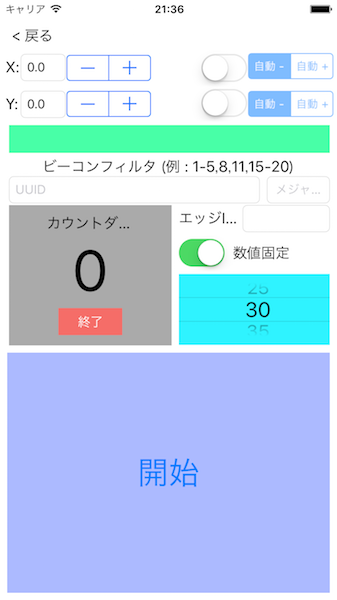

<!--
The MIT License (MIT)

Copyright (c) 2014, 2015 IBM Corporation
Permission is hereby granted, free of charge, to any person obtaining a copy
of this software and associated documentation files (the "Software"), to deal
in the Software without restriction, including without limitation the rights
to use, copy, modify, merge, publish, distribute, sublicense, and/or sell
copies of the Software, and to permit persons to whom the Software is
furnished to do so, subject to the following conditions:

The above copyright notice and this permission notice shall be included in all
copies or substantial portions of the Software.

THE SOFTWARE IS PROVIDED "AS IS", WITHOUT WARRANTY OF ANY KIND, EXPRESS OR
IMPLIED, INCLUDING BUT NOT LIMITED TO THE WARRANTIES OF MERCHANTABILITY,
FITNESS FOR A PARTICULAR PURPOSE AND NONINFRINGEMENT. IN NO EVENT SHALL THE
AUTHORS OR COPYRIGHT HOLDERS BE LIABLE FOR ANY CLAIM, DAMAGES OR OTHER
LIABILITY, WHETHER IN AN ACTION OF CONTRACT, TORT OR OTHERWISE, ARISING FROM,
OUT OF OR IN CONNECTION WITH THE SOFTWARE OR THE USE OR OTHER DEALINGS IN THE
SOFTWARE.
-->

# BLEビーコンの設置と基準測定

本節では、対象施設へのビーコン設置方法、および、基準測定データの収集方法、について記述します。
これらは、ナビゲーションにおいてユーザの現在位置を正確に推定するために必要です。

## <a name="beacon_placement"></a>BLEビーコンの設置

ビーコンの配置はとても重要です。ビーコンを適切に配置しないと位置推定の精度が悪くなり正確なナビゲーションが行えなくなります。

### ビーコン設定
項目|内容
---|---
UUID|対象施設で統一した値を設定
Major|同じフロアにある配置するビーコンには同一のMajorコードを割当
Minor|同一Major内でユニークな値を割当
Power|-8db か -12db を推奨

### 配置計画
ビーコンは互いに適度な距離（約8m～12m）を保って配置する必要があります(Fig. 1)。また、廊下にビーコンを配置する場合には、両側に交互に配置することが推奨されます。



### 実際の配置
ビーコンを設置する際、同時に「ビーコン配置図」を作成することを強く推奨します（※後の基準測定において役立ちます）。ビーコンを配置する毎に、配置図上にビーコン情報(Major/Minor)を記録します。また、各ビーコンは、障害物を避けて配置してください。



## BLEビーコン信号の基準測定
位置推定を行うために、基準測定（ルート上の既知の場所でのBLEビーコン信号データの収集(Fingerprinting)）が必要です。
基準測定では、二つのデータセットを収集します。一つは、位置推定のアルゴリズムにおいて、ルートモデルの生成に利用する「訓練データ」です。もう一つは、そうして生成したルートモデルに基づく位置推定の精度を評価する[精度評価](#acc_eval)に必要な「テストデータ」です。

以下では、基準測定や精度評価の手順、および、基準測定データのNavCogアプリにインポート可能な形式への変換方法について説明します。

※基準測定には、NavCogアプリが必要です。事前にお手持ちのiPhone(iOS機器)へインストールください。（[NavCog on App Store](https://itunes.apple.com/WebObjects/MZStore.woa/wa/viewSoftware?id=1042163426&mt=8)）

### 開発者向けNavCogアプリ設定
基準測定を実施するためには、NavCogアプリを「開発者モード」に切り替える必要があります。

1. iPhoneの「設定」アプリを開く

    

2. リストから「NavCog」を選択する
3. 「開発者モード」をオンにする

    

開発者モードに切り替えると、NavCogのメイン画面の一番下に「**データ取得**」ボタンが出現します。 

## <a name="fingerprinting"></a>基準測定の手順
NavCogを開発者モードで開き、メイン画面一番下の「**データ取得**」ボタンをタップして、基準測定用の画面(Fig. 3)を開きます。
対象施設全体に共通のUUIDを設定します。基準測定は大まかに次の２ステップからなります：

1.	ルート上の各エッジに対して、等間隔（3フィート）にビーコン信号を計測する
2.	iPhoneをMacに接続して、基準測定データをiTunes経由でMacに保存する

上記２ステップを二回繰り返します（訓練データとテストデータを収集するため）。



ステップ１の各エッジでの計測作業は以下のように行います。

### [準備] 各エッジの計測前に行うこと
* 巻尺をエッジに沿って這わせる (障害物がなければ前後9フィートずつ延長する)
  * エッジが**3\*N**フィートで前後に障害物がない場合、全長**3\*(N+6)**フィート歩き、 **N+7**点で計測する
  * 前後それぞれ何フィート延長したかを記録しておく（※ナビゲーション用地図に反映する際に必要になります）
* エッジIDにこれから計測するエッジのIDを設定する
* Majorコードを設定する（既に設定済みの場合はスキップ）
* Minorフィルターに、 当該エッジの近傍にあるビーコンのIDを設定する
  * Fig. 4の例でノード#1とノード#2の間のエッジを計測する場合、1-7を設定する
* サンプル数を30に設定する

### [基準測定] 各計測点で行うこと
* 計測すべき地点に移動する(巻尺に沿って3フィート進む)
* Y に **計測開始点からのフィート数 / 3** を設定する(例えば開始点からの距離が6フィートの場合、2.0を設定)、X は 0.0 のまま固定する
* 「開始」ボタンを押す
  * カウントダウンが始り、一秒に一回ビーコン受信信号強度 (RSSI: Received Signal Strength Indicator)が計測される
  * 計測中は、多様な位置・方角でのデータを収集するため、ルートに対して垂直方向に行ったり来たり歩き回る(Fig. 4参照)


(**注意**: 基準測定アプリは、データをedge-<edge id>-<x>-<y>.txtという名前で**上書き保存**します。訓練データを収集したら、必ずテストデータを収集する前に、下記手順でデータをMacに保存してください。なお、iPhoneを複数台お持ちの場合、訓練データとテストデータを収集するiPhoneを分けることでこの問題は回避できます。)

## 基準測定データの加工

### データの保存（iPhoneからのデータ取り出し）
1. iPhoneをMacにUSB接続する
2. iTunesを開き、接続したiPhoneを選択する
3. メニューリストからアプリケーションを選択する

    
4. ファイル共有のリストの中から「NavCog」アプリを探す
5. デスクトップに新しいフォルダを作成する（訓練データの場合、**train**とする）
5. 「**edge-xxx.json**」という名前のファイルを全て選択して、「**保存**」ボタンを押して、作成したフォルダに保存する

### データファイルの連結

1. Mac上で**ターミナル**アプリを開く
2. 以下のコマンドを実行する

   ```
   cd Desktop
   curl -o concat.sh https://navcog.mybluemix.net/tools/data-merge.sh
   sh data-merge.sh train
   ```

3. 基準測定データが連結され、デスクトップの**train-data**フォルダの中に格納される
※テストデータの場合、sh data-merge.sh testなどフォルダ名を変えるだけで手順は全く同じです。

## <a name="acc_eval"></a>精度評価

1. 上記手順で訓練データとテストデータを連結し、それぞれ**train-data**フォルダと**test-data**フォルダに保存する（両フォルダはデスクトップ上に作成する)

2. **ターミナル** アプリを開く
3. 以下のコマンドを実行する

   ```
   cd Desktop
   curl -o TestAccuracy https://navcog.mybluemix.net/tools/TestAccuracy
   TestAccuracy training-data test-data > result.json
   ```
4. デスクトップ上に、精度評価結果ファイル result.json が生成される

  **aveError**が、位置推定の平均誤差です。 通常、この値は7フィート以下になります。

  ```
{
  "unit": 0.9144,
  "results": [
    {
      "edgeID": 1,
      "testSmpNum": 1260,
      "aveDist": 80.1254,
      "aveDistNorm": 0.0958437,
      "maxDist": 836,
      "minDist": 0,
      "worstPos": {
        "x": 0,
        "y": 10
      },
      "aveError": 4.26773,
      "maxError": 22.7845,
      "minError": 0,
      "prob1U": 0.456349,
      "prob2U": 0.746825,
      "prob3U": 0.898413
    }
  ],
  "description": {
    "aveDist": "Average Distance",
    "aveDistNorm": "Normalized Average Distance",
    "maxDist": "Maximum Distance",
    "minDist": "Minimum Distance",
    "worstPos": "Worst Position",
    "aveError": "Average Error (feet)",
    "maxError": "Maximum Error (feet)",
    "minError": "Minimum Error (feet)",
    "prob1U": "Probability of less than 3 feet (0.9144 meter)",
    "prob2U": "Probability of less than 6 feet (1.8288 meter)",
    "prob3U": "Probability of less than 9 feet (2.7432 meter)"
  }
}
  ```


## 基準測定データのフォーマット
一行目に当該エッジでの基準測定にも用いたビーコンのMinorコードがリストされます。
二行目以降は、各計測点での計測情報が一行ごとにコンマ区切りで記録されています。（各行の内容は以下のとおり）

```
<x座標> (0.0)
<y座標> (48.0)
<信号を受信したビーコンの数> (7)
<一つ目のビーコンのMajorコード> (100)
<一つ目のビーコンのMinorコード> (10)
<一つ目のビーコンのRSSI(受信信号強度)> (-100)
<二つ目のビーコンのMajorコード> (100)
<二つ目のビーコンのMinorコード> (155)
<二つ目のビーコンのRSSI(受信信号強度)> (-70)
…
()内は下記の例での値
```

### 基準測定データの例
```
MinorID of 8 Beacon Used : 5,10,55,60,105,110,155,160,
0.0,48.0,7,100,10,-100,100,155,-70,100,160,-82,100,110,-84,100,105,-85,100,60,-87,100,55,-90,
0.0,48.0,7,100,155,-70,100,160,-82,100,110,-84,100,105,-85,100,60,-89,100,55,-90,100,10,-95,
0.0,48.0,8,100,5,-100,100,10,-100,100,155,-71,100,160,-82,100,105,-86,100,110,-85,100,55,-90,100,60,-88,
…
```
