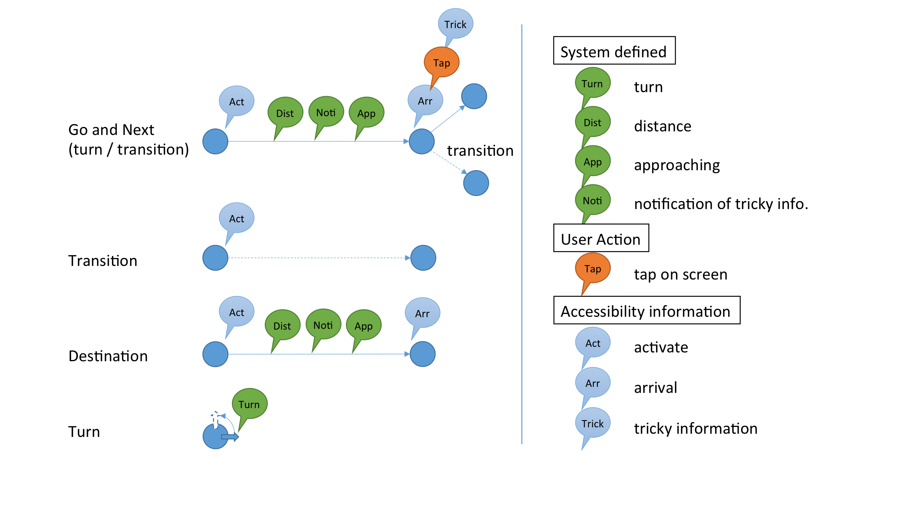

<!--
The MIT License (MIT)

Copyright (c) 2014, 2015 IBM Corporation
Permission is hereby granted, free of charge, to any person obtaining a copy
of this software and associated documentation files (the "Software"), to deal
in the Software without restriction, including without limitation the rights
to use, copy, modify, merge, publish, distribute, sublicense, and/or sell
copies of the Software, and to permit persons to whom the Software is
furnished to do so, subject to the following conditions:

The above copyright notice and this permission notice shall be included in all
copies or substantial portions of the Software.

THE SOFTWARE IS PROVIDED "AS IS", WITHOUT WARRANTY OF ANY KIND, EXPRESS OR
IMPLIED, INCLUDING BUT NOT LIMITED TO THE WARRANTIES OF MERCHANTABILITY,
FITNESS FOR A PARTICULAR PURPOSE AND NONINFRINGEMENT. IN NO EVENT SHALL THE
AUTHORS OR COPYRIGHT HOLDERS BE LIABLE FOR ANY CLAIM, DAMAGES OR OTHER
LIABILITY, WHETHER IN AN ACTION OF CONTRACT, TORT OR OTHERWISE, ARISING FROM,
OUT OF OR IN CONNECTION WITH THE SOFTWARE OR THE USE OR OTHER DEALINGS IN THE
SOFTWARE.
-->

# ナビゲーション用地図の作成
本節では、 NavCogアプリによる視覚障害者のナビゲーション・サービスを提供するために、どのように設計したルートやアクセシビリティ情報を埋め込んだナビゲーション用地図を作成するか、について記述します。

ナビゲーション用地図の作成は、[オンライン地図エディタ](https://navcog.mybluemix.net/map)を用いてWebブラウザ上で行います。具体的には、ルートを編集したり、各ルート周辺に配置したBLEビーコンのリストを指定したりします。

下図は、CMUキャンパスのナビゲーション用地図の例です。



## 区画の追加
1. `マップ` タブを選択

  地図が表示されるので、ナビゲーション・サービスを提供したい施設がある場所へ移動します。

2. **レイヤー**を追加

  レイヤーは、複数階の建物において各階の間取図画像が与えられる場合など、間取図画像を配置する階層を指定します。ナビゲーション用地図には少なくとも一つのレイヤーを指定する必要があります。
  レイヤーを追加するには、`レイヤーを追加`ボタンをクリックします。その際、レイヤーの相対的な高さを**階層**として指定します。建物が一つしかない場合は、階数（1階なら1、2階なら2）を指定できます。但し、建物が複数あって、片方の建物の2階がもう一方の建物の3階と接続しているような場合は、それらが等しい階層を持つように指定する必要があります。

3. **レイヤー**に**リージョン**を追加

  レイヤーには複数のリージョンを追加することができます。一つのリージョンには、一つの間取図画像が対応します。
  リージョンを追加するには、まず、地図上の追加したいおおよその位置をクリックします。クリックすると、**緯度**と**経度**が左側のビューに表示されます。 ローカルマシン上にある間取図画像を選択し、**リージョン名**を指定します（例えば、「○○ビル3階」など）。`リージョンを追加`ボタンをクリックすると、指定した位置に間取図画像が挿入されます。

4. **リージョン**の位置、サイズ、回転角を調整

  間取図（リージョン）の位置やサイズや回転角を、ぞれぞれ調整できます。ナビゲーションの精度には影響しないのであまり厳密に調整する必要はありません。

**注意**: ノードやエッジを編集後にリージョンの調整を行わないでください。

## ノードの追加
1. `ルート` タブを選択
2. `a` キーを押しながら、ノードを追加したい場所をクリック

  通常、ノードは、廊下の交差点、ドア、階段、エレベーター、目的地などに配置します。

### ノード情報
ノードをクリックすると編集できます。
* **タイプ**

| タイプ   | 内容   |
|--------|------------|
| `ノーマル` | 通常のノードはこのタイプです |
| `ドア`, `階段`, `エレベーター` | 各対象物の入り口に配置します。これらのタイプは**遷移**機能で利用されます([補遺](appendix.md#transition)) |
|`目的地`| NavCogアプリの目的地リストに表示されます  |

* **名前**

    目的地リストの表示やナビゲーション時の読上げに利用されます。

* **ID**

    自動で設定されます。

* **建物名**

   建物リストから建物名を選択します。画面左のビューの**建物の追加**で建物名を建物リストに追加できます。

* **フロア**

  何階かを指定します。(階層の値とは異なる場合があります)

* **当ノードに接続しているエッジ**

  当ノードに接続しているエッジを選択します。選択したエッジに対して、以下のアナウンス情報を設定することができます。

* **このエッジから来た時に必要な情報**

   ナビゲーション中に 選択したエッジから当ノードに到着した時に、ここで設定した情報がアナウンスされます。

* **このエッジから来た時に必要な目的地の情報**

   ナビゲーション中に 選択したエッジから当ノードに近づいてきた時に、ここで設定した情報がアナウンスされます。

* **このエッジのトリッキー情報を使う**

   当ノード周辺で、詳細な情報をアナウンスしたい場合に利用します（例えば、非常に複雑に廊下が交差している場合など）。な構造の交差点いナビゲーション中に 選択したエッジから当ノードに近づいてきた時に、ここで設定した情報がアナウンスされます。
   当チェックボックスにチェックを入れた場合、NavCogアプリはユーザが選択したエッジから当ノードに到着した時に、トリッキー情報がある旨をユーザに通知します。ユーザは、スクリーン上のボタンをクリックするか、指定のBluetooth機器のボタンをタップすることで、 トリッキー情報を聞くことができます。

* **遷移先のレイヤー**

    遷移機能を利用する場合に、遷移先のノードが属するレイヤーを指定します。(遷移機能の詳細は[補遺](appendix.md#transition)を参照ください)
    
* **ノードへの遷移を使う**

    当チェックボックスにチェックを入れた場合、選択したノードへの遷移が有効になります。テキストエリアに記述した情報は、ナビゲーション中にユーザに遷移を促す際に読上げられます。

* **対象kNN距離と位置**

    kNN距離は0.1、位置は5 (ft)がデフォルト値です。 遷移機能で利用されます。遷移機能利用時にナビゲーションの精度が向上させたい場合に、[補遺](appendix.md#transition)を参照して適当な値を設定してください。

## エッジの追加
1. `ルート` タブを選択
2. `s`　 キーを押しながら、エッジを追加したい場所をクリック

   エッジは二つのノード間がつながっていることをあらわします。また、位置推定に必要な基準測定データは、エッジごとに保存されます。

### エッジ情報
* **ID**

    自動で設定されます。

* **長さ (ft)**

    自動で設定されますが、実地で巻尺を用いて実測した長さを設定しなおす必要があります。単位はフィートです。

* **方角 (度)**

    エッジの方角です。北を0度として、時計回りの角度で指定します。例えば、エッジが東北向きの場合、45(度)を指定します。
    
    方角は厳密に計測する必要はありません。数度の誤差があってもナビゲーションの精度には影響ありません。

* **開始点 (x, y)**, **終了点 (x, y)**

    始点と終点の座標を指定します。x座標は常に0で、y座標に始点のオフセット分手前からの距離を指定します。例えば、エッジの長さが100フィートで、オフセットを9フィートにした場合、始点は(0,9)、終点は(0, 109)になります。 (オフセットは [基準測定](beacon.md#fingerprinting)で必要になります)

* **最小KnnDist**, **最大KnnDist**

    [補遺](appendix.md#knnDist)を参照ください

* **データファイル**

    このエッジの基準測定データを指定します。

* **このノードから来た時に必要な情報**

   NavCogアプリは、ユーザが指定ノードから当エッジに入ったタイミングでこの情報を読上げます。

## アクセシビリティ情報の追加

ノードやエッジにアクセシビリティ情報を追加しなかった場合、NavCogアプリは、「右へ曲がって30フィート進んでください」のような単純な案内情報しか提供しません。各種アクセシビリティ情報を追加することで、ナビゲーション状態に応じた豊かな情報を視覚障害ユーザに提供することができるようになります。

### ナビゲーション状態とアクセシビリティ情報





情報種別|タイミング
---|---
[**あるノードにあるエッジから来た時に必要な情報**](#acc_info1)|`Go and Next - Arrival`
[**あるノードにあるエッジから来た時に必要な目的地の情報**](#acc_info2)|`Destination - Arrival`
[**あるノードにあるエッジから来た時のトリッキー情報**](#acc_info3)|`Tricky information`
[**あるノードから別のノードへ遷移する時の情報**](#acc_info4)|`Transit - Activate`
[**あるエッジにあるノードから来た時に必要な情報**](#acc_info5)|`Go and Next - Activate`



## ビーコンの追加
1. `ビーコン`タブを選択
2. ビーコンを追加する`レイヤー`を選択
2. `a`キーを押しながら、ビーコンを追加したい場所をクリック

### ビーコン情報
 |説明
---|---
UUID|ビーコンのUUID文字列（例："f4376677-0906-41a4-b3ab-949bd675e58c"）
メジャーID|ビーコンのMajor ID
マイナーID|ビーコンのMinor ID
製品情報|補足情報の記述用に自由にお使いください
ビーコンID|自動設定

## 作成した地図ファイルのエクスポート

* **ファイル**タブを選択
* **ローカルに保存**の**保存**ボタンを押して地図ファイル(JSON形式)をダウンロード
